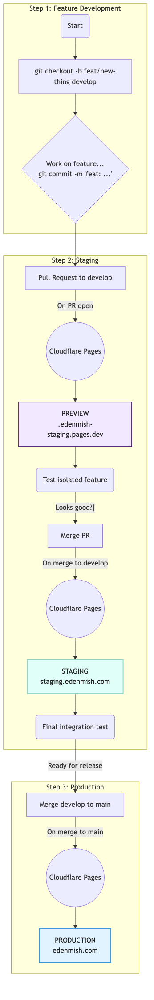

# CI/CD

GitHub Actions workflows for EdenMish — PR checks, Shopify theme previews, and
manual production deployment.

---

## Branch strategy

```
main     → edenmish.com (production)      [protected — PR required]
develop  → staging.edenmish.com (staging) [test before release]
feat/*   → <branch>.edenmish-staging.pages.dev (auto-preview)
```



The editable Mermaid source is [ci-cd-flow.mmd](./ci-cd-flow.mmd).

**Workflow:**

1. Create a feature or fix branch from `develop` and use conventional commits.
2. Open a PR to `develop`; CI and the isolated Pages preview must pass.
3. Merge to `develop`; test the integrated result on `staging.edenmish.com`.
4. Open a PR from `develop` to `main` when staging is approved.
5. After merge to `main`, storefront changes deploy through `storefront.yml` and
   `release.yml` creates the appropriate version tag.
6. Production Worker and Shopify theme changes remain manual through
   `production-deploy.yml` and require GitHub environment approval.

To preserve shared branch ancestry, merge the `develop` → `main` release PR
without squashing whenever branch protection permits it. If a temporary release
branch or squash merge is required, merge the resulting `main` commit back into
`develop` immediately after production verification. This prevents equivalent
changes with different commit identities from causing false conflicts in the
next release PR.

**Versioning:** `release.yml` derives the version bump from conventional commits.
The build stamp is generated by `scripts/inject-version.js`.

## Why CI/CD exists

Merging a PR into `main` on GitHub does **not** automatically update `edenmish.com`
or the Cloudflare Worker. Three separate systems must be coordinated:

1. **GitHub** — source control, PR review, merge.
2. **Cloudflare** — Worker deployment (`wrangler deploy`) + D1 database.
3. **Shopify** — theme publishing (`shopify theme push`).

CI/CD bridges these safely: PR checks catch syntax errors before merge; theme
previews let you test on a real Shopify instance; production deploys are manual
and gated by environment approval.

---

## Workflows

### `ci.yml` — PR checks

**Trigger:** `pull_request` to `main` or `develop`.

**Checks:**
- Worker: installs dependencies, runs the Worker test suite, then syntax-checks
  every `worker/src/*.js` file.
- Storefront: installs dependencies, runs the storefront tests, then runs the
  canonical inline-JavaScript syntax checker.
- Theme: runs `shopify theme check --path theme`; warnings are allowed, errors fail CI.
- Version metadata: validates that `scripts/current_version.sh` returns `X.Y.Z`, that
  `scripts/compute_build_number.sh` returns an integer, and that
  `scripts/bump_version.sh --dry-run` runs without error.

**Secrets required:** none. CI runs without any credentials.

---

### `storefront.yml` — Storefront build + deploy

**Trigger:** `push` or `pull_request` to `main` or `develop`, only when
`storefront/**` changes.

**Behavior:**
- Computes version metadata (`APP_VERSION` from `VERSION`, `BUILD_NUMBER` from
  `scripts/compute_build_number.sh`, `GIT_SHA` from `git rev-parse --short HEAD`)
  and exposes it as env vars for the build.
- `npm run build` runs Tailwind, then `storefront/scripts/inject-version.js`
  bakes `<meta name="app-version">` + a footer stamp into every `public/*.html`.
- On `push` to `main`: deploys `public/` to Cloudflare Pages (`edenmish-v2` project).

**Secrets required:** `CLOUDFLARE_API_TOKEN`, `CLOUDFLARE_ACCOUNT_ID`.

---

### `staging-worker.yml` — isolated staging Worker

**Trigger:** pushes to `develop` that change `worker/**`, or manual
`workflow_dispatch`.

**Behavior:**
- runs the full Worker test suite;
- renders `worker/wrangler.staging.toml` with the staging D1 database ID from
  the GitHub `staging` environment;
- deploys `edenmish-ops-staging` to `find-staging.edenmish.com` and
  `ops-staging.edenmish.com` with staging-only auth secrets;
- verifies `/health` and the credentialed CORS origin for
  `staging.edenmish.com`.

It never binds the production `edenmish` D1 database and does not receive
Shopify, payment, email, or webhook credentials.

**Environment:** `staging`.

**Required configuration:** `STAGING_D1_DATABASE_ID` environment variable;
`STAGING_OPS_PIN` and `STAGING_SESSION_SECRET` environment secrets; shared
`CLOUDFLARE_API_TOKEN` and `CLOUDFLARE_ACCOUNT_ID` repository secrets.

---

### `shopify-preview.yml` — Shopify theme preview

**Trigger:** `pull_request` to `main`, only when `theme/**` files change.

**Behavior:**
- Injects version metadata into `theme/snippets/app-version.liquid` so the
  preview shows the same stamp production will.
- Pushes an **unpublished** theme to the Shopify store using `shopify theme push --unpublished`.
- Extracts the preview URL from the JSON output.
- Comments the preview URL on the PR (updates if re-run).
- Prints the URL in the GitHub Actions summary.

**Never publishes live.**

**Secrets required:** `SHOPIFY_CLI_THEME_TOKEN`, `SHOPIFY_STORE`.

**Environment:** `preview`.

---

### `release.yml` — auto-tag from conventional commits

**Trigger:** `push` to `main` (typically a merged PR).

**Behavior:**
- Runs `scripts/bump_version.sh --tag` — reads Conventional Commit messages
  since the last `v*` tag and creates a new tag:
  - `BREAKING CHANGE:` / `<type>!:` → major
  - `feat:` → minor
  - `fix:`, `perf:`, `refactor:`, … → patch
  - `chore:`, `test:`, `docs:` only → no bump (exits 0)
- If a new tag was created: pushes only the tag to origin.
  **Never commits to main** — main's history stays 100% human-authored.
- If no bump: no-op.

**This workflow does NOT deploy.** Production deploy stays manual per §8 of
`AGENTS.md`. The bump only advances the version *name*; the build *number* is
always recomputed at deploy time.

**Why tags, not a VERSION file:** tags are not subject to branch protection,
so this workflow needs only `contents: write` for tag pushes (never for
branch pushes). It works regardless of main's protection rules, and there's
no self-trigger loop to guard against.

**Permissions:** `contents: write` (to push the `vX.Y.Z` tag).

**Secrets required:** none beyond the default `GITHUB_TOKEN`.

---

### `production-deploy.yml` — manual production deploy

**Trigger:** `workflow_dispatch` only (manual button in GitHub Actions tab).

**Inputs:**
| Input | Type | Description |
|---|---|---|
| `deploy_worker` | boolean | Deploy the Cloudflare Worker |
| `deploy_theme` | boolean | Push the Shopify theme (unpublished) |
| `publish_theme` | boolean | Also publish the theme **live** |
| `confirm_migrations_ran` | string | Must type exactly `I ran required migrations` |

**Behavior:**
1. Fails immediately if `confirm_migrations_ran` ≠ `I ran required migrations`.
2. Computes version metadata (latest `v*` tag via `current_version.sh` +
   `compute_build_number.sh` + git SHA).
3. Injects the version into the Worker (`worker/src/version.js`) and theme
   (`theme/snippets/app-version.liquid`) before any deploy runs. The injected
   values are not committed — they live only in the CI runner's checkout.
4. If `deploy_worker`: `cd worker && npx wrangler deploy`.
5. If `deploy_theme`: `shopify theme push --unpublished`.
6. If `publish_theme`: `shopify theme push --live` (requires `deploy_theme` too).

**Never runs automatically on push/merge.**

**Environment:** `production` (requires manual approval if protection rules are set).

**Secrets required:** `CLOUDFLARE_API_TOKEN`, `CLOUDFLARE_ACCOUNT_ID`, `SHOPIFY_CLI_THEME_TOKEN`, `SHOPIFY_STORE`.

---

## Required GitHub configuration

### Environments

Create these in **GitHub → Settings → Environments**:

| Environment | Purpose | Protection rules |
|---|---|---|
| `preview` | Theme preview pushes | None required |
| `staging` | Isolated staging Worker | Optional approval; keep secrets separate from production |
| `production` | Production deploy | **Required reviewers** (add yourself) |

### Secrets

Add in **GitHub → Settings → Secrets and variables → Actions**:

| Secret | Used by | Example |
|---|---|---|
| `SHOPIFY_CLI_THEME_TOKEN` | preview + production | `shptka_…` (from Shopify Theme Access app) |
| `SHOPIFY_STORE` | preview + production | `r013gt-fc.myshopify.com` (canonical domain — `edenmish.myshopify.com` is an alias that the Theme Access proxy rejects with 401) |
| `CLOUDFLARE_API_TOKEN` | staging + production | Cloudflare API token with Workers and D1 edit permission |
| `CLOUDFLARE_ACCOUNT_ID` | staging + production | Cloudflare account ID |
| `STAGING_OPS_PIN` | staging only | A staging-only PIN; never reuse the production PIN |
| `STAGING_SESSION_SECRET` | staging only | A unique random staging session secret |

Add `STAGING_D1_DATABASE_ID` as a variable on the GitHub `staging` environment.

> Do not put real values in workflow files or docs. These are GitHub repository secrets only.

---

## Version metadata

Every deployed surface reports a build stamp of the form
`vX.Y.Z #BUILD_NUMBER (GIT_SHA)` — e.g. `v0.2.0 #270421 (77fe86e)`.

- **`X.Y.Z`** — the release name. Source of truth is the **latest `v*` git tag**
  (read by `scripts/current_version.sh`). Tags are created automatically by
  `release.yml` from Conventional Commits; never blocked by branch protection.
- **`BUILD_NUMBER`** — minutes since `2026-01-01 00:00:00 UTC`, computed by
  `scripts/compute_build_number.sh`. Monotonic across branches/runners.
  Override with the `BUILD_NUMBER` env var (CI / hotfix).
- **`GIT_SHA`** — `git rev-parse --short HEAD` at build time.

> **Why tags, not a VERSION file:** a VERSION file requires the release bot
> to commit back to main, which collides with branch protection rules.
> Tags live outside branch protection, so the bot needs only `contents: write`
> for tag pushes — never for branch pushes. Main's history stays 100%
> human-authored.

### Where the stamp shows up

| Surface | Where | How it's injected |
|---|---|---|
| Worker — customer tracking page (`find.edenmish.com/t/:token`) | Footer line below the timeline | `worker/src/version.js` (rewritten by `scripts/inject-worker-version.sh` before `wrangler deploy`) |
| Worker — ops dashboard (`ops.edenmish.com`) | Toolbar, next to the bike icon | Same |
| Storefront (`edenmish.com`, all HTML pages) | `<meta name="app-version">` in `<head>` + footer stamp on customer pages | `storefront/scripts/inject-version.js` runs as part of `npm run build` |
| Shopify theme (`edenmish.com` Shopify-served pages) | Footer via `` in `theme/layout/theme.liquid` | `theme/snippets/app-version.liquid` (rewritten by `scripts/inject-theme-version.sh` before `shopify theme push`) |

### Local dev

The committed files ship `0.0.0-dev` defaults so `wrangler dev`, the theme
preview, and `npm run build` all work without any version generation. CI
overwrites the values at deploy time only.

### Local build side effect

`cd storefront && npm run build` mutates `public/*.html` in place with the
current version stamp. To discard the local changes after a build:

```bash
git checkout -- storefront/public/
```

### Manual bump (hotfix / pre-release)

To cut a release manually instead of waiting for `release.yml`:

```bash
./scripts/bump_version.sh --tag
git push origin "v$(./scripts/current_version.sh)"
```

(`current_version.sh` will then return the new tag on the next run.)

---

## Production deployment sequence

```
1. Merge feature PR(s) into develop, validate staging, then manually merge develop into main
2. Run D1 migrations manually (see worker/MIGRATIONS.md):
     wrangler d1 execute edenmish --remote --file=./migrations/003_rate_limits.sql
     wrangler d1 execute edenmish --remote --file=./migrations/004_delivery_proofs.sql
     wrangler d1 execute edenmish --remote --file=./migrations/005_notifications.sql
     wrangler d1 execute edenmish --remote --file=./migrations/006_pod_signature.sql
     wrangler d1 execute edenmish --remote --file=./migrations/007_order_rating.sql
     wrangler d1 execute edenmish --remote --file=./migrations/008_coupons.sql
     wrangler d1 execute edenmish --remote --file=./migrations/009_invoice_tracking.sql
     wrangler d1 execute edenmish --remote --file=./migrations/010_order_service_schedule.sql
     wrangler d1 execute edenmish --remote --file=./migrations/011_cancellation_requests.sql
3. Go to GitHub → Actions → "Production deploy" → Run workflow
     - confirm_migrations_ran = "I ran required migrations"
     - deploy_worker = true
     - deploy_theme = true
     - publish_theme = false (preview first)
4. Test the unpublished theme preview
5. Re-run with publish_theme = true when ready
6. Smoke test the full order flow
```

---

## Rollback

| System | Rollback method |
|---|---|
| Cloudflare Worker | Cloudflare dashboard → Workers → previous deployment version (or re-run the workflow from an older `main` commit) |
| Shopify theme | Re-publish the previous theme version from the Shopify admin theme library |
| D1 migrations | Not automatically reversible — always test on a dev DB first. New tables are additive and can be safely ignored if rolled back. |

---

## Safety rules

- **No auto live-deploy on merge.** Production deploy is `workflow_dispatch` only.
- **No D1 migrations run automatically.** They are always manual + confirmed.
- **Production environment requires approval** (GitHub environment protection rule).
- **Theme live publish defaults to `false`** — you must explicitly opt in.
- **No secrets in workflow files.** All credentials are GitHub repository secrets.


## Staging environment setup

Staging uses a **separate Cloudflare Pages project** to ensure 100% isolation from production.

| Project Name | GitHub Branch | Custom Domain | Environment |
| :--- | :--- | :--- | :--- |
| `edenmish-v2` (existing) | `main` | `edenmish.com` | **Production** |
| `edenmish-staging` (new) | `develop` | `staging.edenmish.com` | **Staging** |

### How to create the staging project:

1. Cloudflare Dashboard → Pages → Create application → Connect to Git
2. Repository: `talagmon/edenmish.com`
3. Project name: `edenmish-staging`
4. Production branch: `develop`
5. Build settings:
   - Framework preset: `None`
   - Build command: `npm run build`
   - Build output directory: `storefront/public`
   - Root directory: `storefront`
6. Save and Deploy
7. After first deploy, add `staging.edenmish.com` as a custom domain.

### Staging Worker

The staging storefront uses an isolated Worker and D1 database:

| Surface | Staging host |
|---|---|
| Public order/tracking API | `find-staging.edenmish.com` |
| Ops API | `ops-staging.edenmish.com` |
| D1 | `edenmish-staging` |

One-time setup, before merging the staging-worker PR:

```bash
cd worker
npx wrangler d1 create edenmish-staging

# Use the returned UUID locally and save the same UUID as the GitHub staging
# environment variable STAGING_D1_DATABASE_ID.
STAGING_D1_DATABASE_ID=<returned-uuid> node scripts/render-staging-config.mjs
npx wrangler d1 execute edenmish-staging --remote \
  --config wrangler.staging.generated.toml --file=./schema.sql
```

For an existing staging database, apply new numbered migrations manually before
deploying Worker code that depends on them. For migration 011:

```bash
npx wrangler d1 execute edenmish-staging --remote \
  --config wrangler.staging.generated.toml \
  --file=./migrations/011_cancellation_requests.sql
```

The GitHub deployment token intentionally does not run D1 migrations; use an
authorized operator session and verify the migration before triggering the workflow.

Then create the GitHub `staging` environment and add:

- variable: `STAGING_D1_DATABASE_ID`
- secrets: `STAGING_OPS_PIN`, `STAGING_SESSION_SECRET`
- repository secrets: `CLOUDFLARE_API_TOKEN`, `CLOUDFLARE_ACCOUNT_ID`

Run **Actions → Staging Worker → Run workflow** once. Subsequent Worker changes
merged to `develop` deploy automatically. Do not add production Shopify,
payment, webhook, email, or customer data credentials to the staging Worker.

### Conventional commits for versioning

Use conventional commit prefixes on feature branches. After an approved PR from
`develop` is merged into `main`, `release.yml` calculates the version bump from
those commits and creates the corresponding `v*` tag. Do not merge or push
directly to `main`, and do not create a competing manual version bump.

The `scripts/inject-version.js` script auto-stamps `package.json` version into
HTML metadata on every build.
