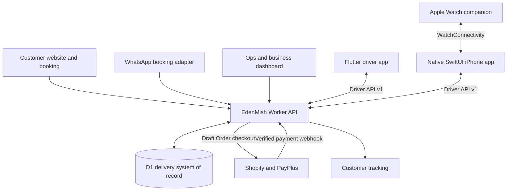

# EdenMish project map

Verified from local Git metadata and source on 10 October 2026. This is a map of
repositories and integration boundaries, not evidence of current deployment,
App Store availability, an active WhatsApp session, or merged changes.

## One product, several clients, one delivery backend

The WhatsApp adapter runs inside the same Worker codebase; the arrow above is a
logical boundary, not a second backend. Its order service invokes the canonical
order handler. The conversation-only rehearsal stops before creating an order.
Mobile apps consume authenticated APIs; they do not access D1 directly.

## Repository and folder relationships

On this Mac, `~/dev` is a symlink to `~/Development`. Local folder names identify
checkouts; the Git origin identifies the repository.

| Local folder | Git repository | Role and relationship |
| --- | --- | --- |
| `~/dev/edenmish.com` | `talagmon/edenmish.com` | Main local checkout. `storefront/` contains the static web client; `theme/` contains Shopify theme integration; `worker/` contains order, pricing, payment reconciliation, tracking, Ops, business, and Driver API code. |
| `~/dev/edenmish-whatsapp` | **Same** `talagmon/edenmish.com` | Separate clone for the WhatsApp booking feature, including voice, multilingual and conversational work. Continue that work on `feat/whatsapp-booking`. It is not a separate product or backend repository. |
| `~/dev/eden-driver-ios` | `talagmon/eden-driver-ios` | Separate SwiftUI iPhone repository with a shared Swift core, Watch app and complication code. Calls the EdenMish Driver API. Its README describes native iOS as the successor under a gated cutover; current release status must be verified separately. |
| `~/dev/eden-driver` | `talagmon/eden-driver` | Separate Flutter driver repository, with iOS and Android targets. Calls the same versioned Driver API. The native repository names Flutter as its reference/rollback client; do not infer retirement from the native folder's existence. |
| `~/dev/edenmish-v2` | `talagmon/edenmish-v2` | Separate frontend-only repository documented as an alternate storefront. Its documented order API is the existing Worker. Do not assume it is the current canonical storefront or migrate work here based on the name; the main repository also has `storefront/`. Current deployment/retirement status is unverified. |

`~/dev/stitch_edenmish_3d_delivery_platform` is a local design-reference folder
without its own Git repository in this inventory. It is not a confirmed runtime
or deployment target.

## What owns each kind of work

| Change | Primary implementation | Also check |
| --- | --- | --- |
| Booking chat, transcription, reply language or conversational approach | `edenmish-whatsapp/worker/src/whatsapp-booking*.js` | Canonical validation, price, consent, confirmation, schema migrations and bounded test grants. |
| Order fields, pricing, payment state or delivery status | `edenmish.com/worker/` on the relevant feature branch | Website, WhatsApp and mobile consumers; D1 migrations; do not duplicate authority in a client. |
| Driver authentication, route data, execution events, GPS, proof or push | `edenmish.com/worker/src/driver-api.js` and related modules | Both mobile clients and the versioned API contract. |
| iPhone/Watch UI, native offline queues and device behavior | `eden-driver-ios/` | Driver API compatibility; Watch/phone contract; independent build and release gates. |
| Flutter UI, Android behavior and Flutter maintenance | `eden-driver/apps/driver/` | Driver API compatibility and independent mobile delivery workflow. |
| Website and booking UI | `edenmish.com/storefront/` | Worker API; Shopify checkout boundary; current deployment configuration. |

Worker + D1 remains authoritative for delivery orders, prices, status, payments
and dispatch. Shopify provides the checkout/payment shell; PayPlus stays inside
Shopify. Mobile execution events are validated by the Worker. No client or chat
message can independently mark a payment as paid.

## Git relationships and continuing work safely

- `edenmish.com` and `edenmish-whatsapp` are local clones of the same GitHub
  repository, each with its own `.git` directory. Branches, index, local commits
  and uncommitted files do not automatically synchronize between them.
- The current WhatsApp feature is developed on `feat/whatsapp-booking`. Verify
  that branch and its working tree before continuing; a folder named like the
  product does not imply branch `main` or current production code.
- Most other local `edenmish-*` folders are feature/fix/release worktrees. Confirm
  this with `git worktree list` and `git rev-parse --git-common-dir`; do not infer
  a new product, merged status, or permission to delete from the folder name.
- Mobile repositories have independent histories and release workflows. Keep the
  `/api/driver/v1` contract compatible across both clients when changing it.
- Inspect each affected checkout and read its own instructions. Preserve existing
  work and integrate through reviewed Git changes when authorized. Never copy a
  whole tree over another dirty checkout or use symlinks as a sync mechanism.
- Backend changes target `develop` before the normal production promotion.
  Mobile changes follow their own repository workflow. Shared product membership
  does not authorize deploying, releasing, spending, or messaging across projects.
- A fresh clone needs only its own `PROJECT_CONTEXT.md` and `AGENTS.md` to
  understand its role. Use the repository links below when siblings are absent.
  This map documents source relationships, not current deployment/activation state.

### Repository links

- [Website, Worker and WhatsApp codebase](https://github.com/talagmon/edenmish.com)
- [Native iPhone and Watch app](https://github.com/talagmon/eden-driver-ios)
- [Flutter driver app](https://github.com/talagmon/eden-driver)
- [Alternate storefront](https://github.com/talagmon/edenmish-v2)

## Evidence and starting points

- Local `git config --get remote.origin.url`, `git rev-parse --git-common-dir`,
  branch, status and HEAD checks distinguish clones, worktrees and repositories.
- [Backend architecture](ARCHITECTURE.md) describes authority and checkout;
  some opening storefront wording predates the separate `storefront/` tree.
  Check [CI/CD](CI_CD.md) and current workflow/config files for the actual target.
- [Worker reference](../worker/README.md) and `worker/src/driver-api.js` define
  the backend boundary. Production client configuration uses
  `https://ops.edenmish.com`; Flutter staging documents
  `https://ops-staging.edenmish.com`. These are source/config observations, not
  live service checks.
- WhatsApp checkout: `worker/src/index.js` → `bookingServices` → canonical
  `/api/orders`, plus `docs/WHATSAPP_VOICE_MULTILINGUAL.md`. These files/features
  may not yet exist in another branch of the main repository.
- [Native iOS README](https://github.com/talagmon/eden-driver-ios/blob/main/README.md),
  [typed endpoints](https://github.com/talagmon/eden-driver-ios/blob/main/EdenDriverCore/Sources/EdenDriverCore/DriverAPIEndpoint.swift),
  [app bootstrap](https://github.com/talagmon/eden-driver-ios/blob/main/EdenDriverNative/Core/App/DriverAppBootstrap.swift),
  and `EdenDriverNative/Core/Watch/PhoneWatchBridge.swift` establish native and
  Watch integration.
- [Flutter README](https://github.com/talagmon/eden-driver/blob/main/README.md),
  [Driver v1 contract](https://github.com/talagmon/eden-driver/blob/main/contracts/openapi/driver-v1.yaml),
  and `apps/driver/lib/src/features/active_route/data/http_driver_repository.dart`
  establish Flutter integration.
- [Alternate storefront README](https://github.com/talagmon/edenmish-v2/blob/main/README.md) documents its
  frontend-only relationship. Cross-repository links work on GitHub without the `~/dev` layout.

If a local Graphify index is available, use it to locate relationships, then
verify them in current source. An index is not a release registry.
